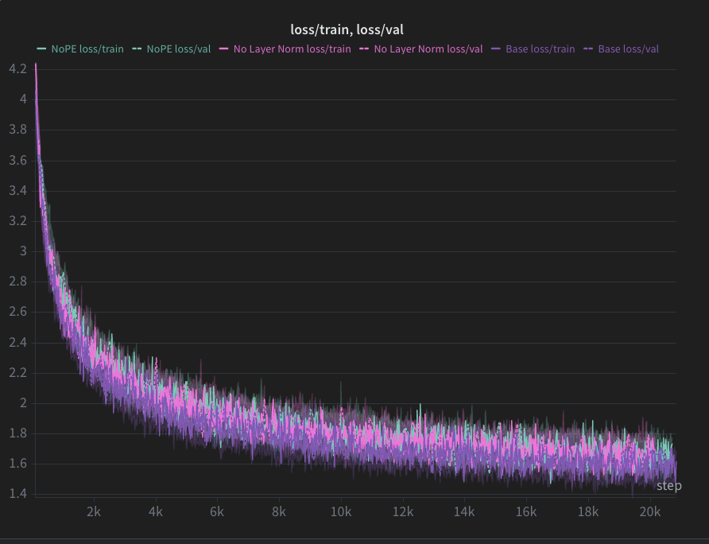

# 2.4 BPE Tokenizer Training

Naively merging bytes next to each other could result in the creation of a vocabulary like {"g!", "g.", "do"}. However, a better vocabulary would be {"dog", "!", "."}, so that semantic meaning doesn't get annhilated by how BPE arbitrarily separates bytestrings into separate tokens.

# 2.7 Experiments
## (a)
The compression ratio is 4.04 bytes per token, taken as an average over 10 documents sampled uniformly at andom from TinyStoriesV2-GPT4-train.
## (b)
The token IDs are non-negative integers, so by using an unsigned integer we get the full range enabled by 16 bits. We use uint16, instead of uint8, uint32, etc. because uint16 is the smallest unsigned integer size that can still represent the integers including the length of our vocabulary.

# 3.2.4 Insight (softmax): Handling numerical instability
You can subtract the max of v from each v_i. This is because of the invariance that softmax(v)_i = softmax(v + c)_i for any constant c, and now the input to the exp function is always non-positive, so you never get exponential explosion.

# 3.2.4 Insight: Masking
We can set the pre-softmax values corresponding to masked entries to a very large (in magnitude) negative number (like -inf), thereby making the exponential in the softmax turn them into roughly zero probability entries.

# 4.1 Insight: Perplexity
Although perplexity is just a monotonic transformation of cross entropy, found by taking the exponentiation, perplexity is much easier to interpret. For instance, a perplexity score of N means the model is behaving as if it is choosing among about N equally likely next tokens on average, whereas cross entropy is measured in either nats or bits.

# 6 Insight: Temperature in Softmax
For very small temperature, we get exponential blowup, causing the probability distribution to be exceptionally spikey, like a delta distribution at the most probable next token. This makes sampling highly deterministic. For larger temperatures, the probability distribution becomes more uniform, allowing for more sampling variability.

# 7.2 Problem (generate): Generate text

Here is one sample from the trained model (prompt in bold):

>**Once upon a time,** there was a gifted dog named Max. Max lived in a small house with his family. He liked to play with his ball all day. One day, Max saw a big ball in the yard. He wanted to play with it.
>Max ran into the yard and started to play with the ball. He would chase the ball and try to catch it. The yard had a lot of work to save the ball from the yard. Max's family knew it was not safe. They were sad and did not want to play with Max.
>Max was sad, but then he had an idea. He found a long stick and threw it far away. The ball flew to Max's yard and ran to the yard. Max was happy and wagged his tail. He played with the ball all day. The end.

The text is coherent for the first few sentences, but then the model begins to struggle keeping the plot intact. It especially struggles with subject-object relationships as the context increases.

If you set the temperature very low (0.01), generation becomes very deterministic, and the model repeats itself:

>**The**n, something unexpected happened. The big, red ball started to grow bigger and bigger! It was not a ball at all, but a big, red balloon! The balloon was not a balloon, but a balloon! The balloon was a balloon! The balloon was a balloon, and it was a balloon! The balloon was not a balloon, but a balloon balloon! The balloon was a balloon balloon! The balloon was a balloon balloon, and it was a balloon balloon. The balloon was a balloon, and the balloon was a balloon! The balloon was a balloon, and the balloon was a balloon. The balloon was a balloon, and the balloon was a balloon! The balloon was a balloon balloon, and the balloon was a balloon. The balloon was a balloon, and the balloon was a balloon. The balloon was a balloon, and the balloon was a balloon. The balloon was a balloon, and the balloon was a balloon. The balloon was very happy, and the balloon was happy too.

# 7.3 Ablations and architecture modification

I actually did not have to change any of my hyperparameters and saw no noticeable difference in performance between the base architecture, the no LayerNorm ablation, and the NoPE ablation.

I did not make these ablations part of the CLI, I simply commented out the positional embedding lines for the NoPE ablation, and commented out the forward pass of the LayerNorm layer to replace it with the identity function for the no LayerNorm ablation.

